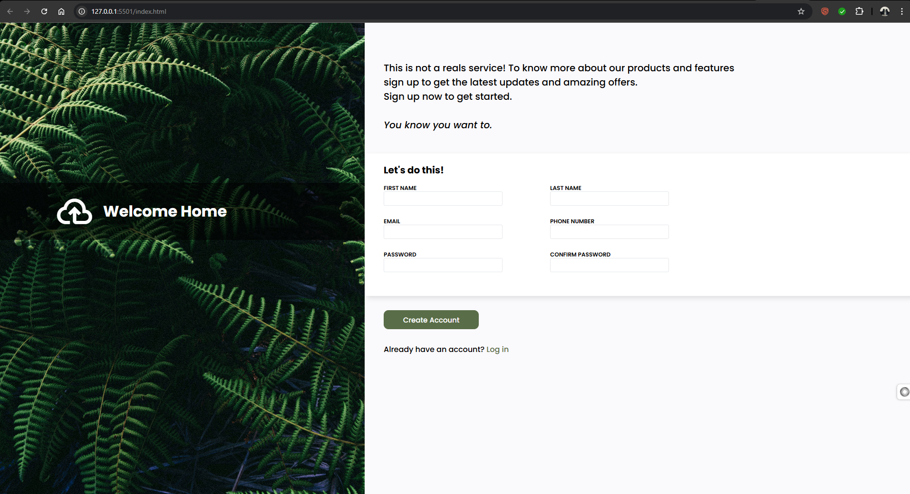

# 📝 Sign-Up Form

A sleek and responsive **Sign-Up Form** designed using **HTML** and **CSS**. Featuring a clean glassmorphism interface, input icons, and modern form elements — perfect for user registration in web applications.

 <!-- Replace this with the actual screenshot if available -->

---

## 🌟 Features

- ✨ Beautiful glassmorphism design with blurred background
- 🔐 Form fields for name, email, password, and confirmation
- 🧾 Stylish placeholders and input icons
- 📱 Fully responsive and centered layout
- 💡 Hover effects and interactive styling
- ⚙️ Built with just HTML and CSS (no frameworks)

---

## 📁 Project Structure

signup-form/
├── index.html # HTML file for the signup form
├── style.css # CSS styles with glassmorphism and layout
└── img.jpg # Background image for the form

